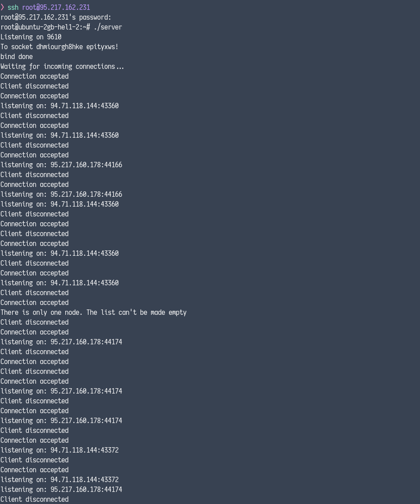
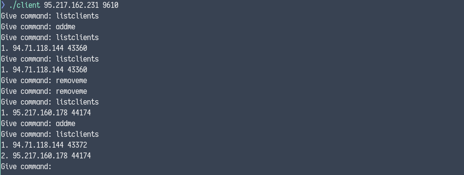
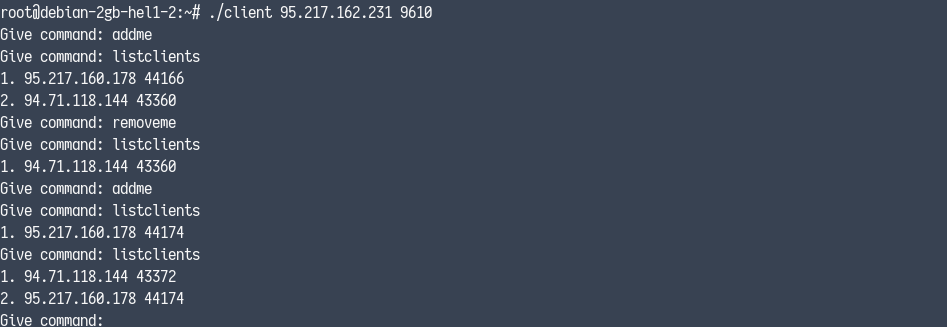

# Computer Networks Lab 2015

This repository contains two course assignments for the **Computer Networks Lab** university course for the
academic period of 2015-2016 done by <a href="https://github.com/PARVD0XSVPR3ME">Panagiotis Charalampopoulos</a>.

## Assignment 1

This assignment covers networking fundamentals, IP addressing, subnetting, and network tables (MAC address
tables, ARP tables and routing tables).

Contains my answers (in Greek)

## Assignment 2

A **TCP Server-Client implementation** with support for handling **multiple clients** on server using **socket
programming in C**.

- The server uses a **linked list** in order to store each client's **IP** and **port**.
- The server accepts the following three commands from the client as valid:
  - `addme` : Adds the client to the linked list
  - `removeme` : Removes the client from the linked list
  - `listclients` : List all the clients saved in the linked list

### Compilation Instructions

```bash
gcc server.c -o server
gcc client.c -o client
```

### Usage

```bash
./server
./client <SERVER_IP> <SERVER_PORT>
```





# License
All files are licensed under the  [AGPL-3.0](https://www.gnu.org/licenses/agpl-3.0.en.html)

Copyright © <a href="https://github.com/PARVD0XSVPR3ME">Panagiotis Charalampopoulos</a>
